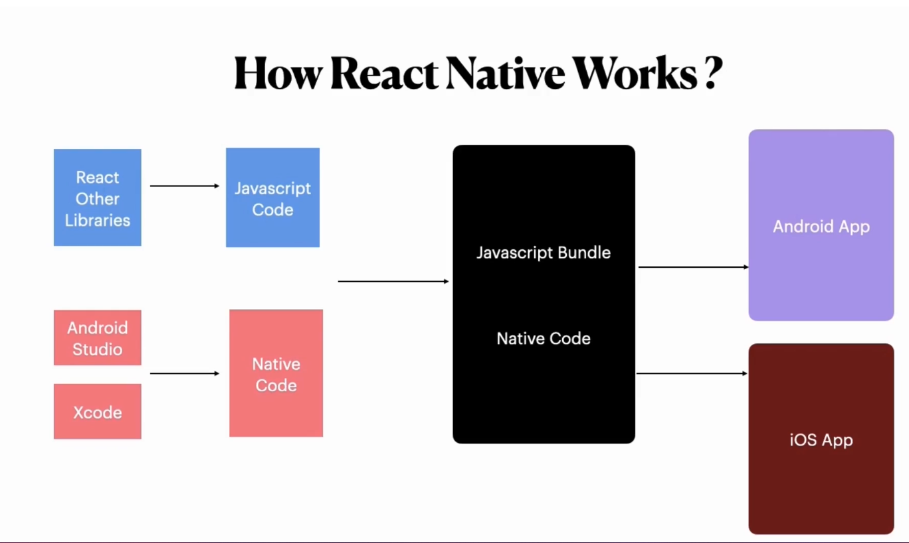

# react_native_app
Messin around with react native, not sure which direction I'm taking this yet.

## About React Native
* React Native is an open source framework for building Android and iOS mobile Applications.
* started as an internal facebook project in 2013.
* Based on JS language.
* Uses React UI libraries and Platform's Native capabilities
* Single Codebase - Multiple Platforms
* All components which exist in JS have corresponding components which exist in both Android and iOS

## How React Native works
